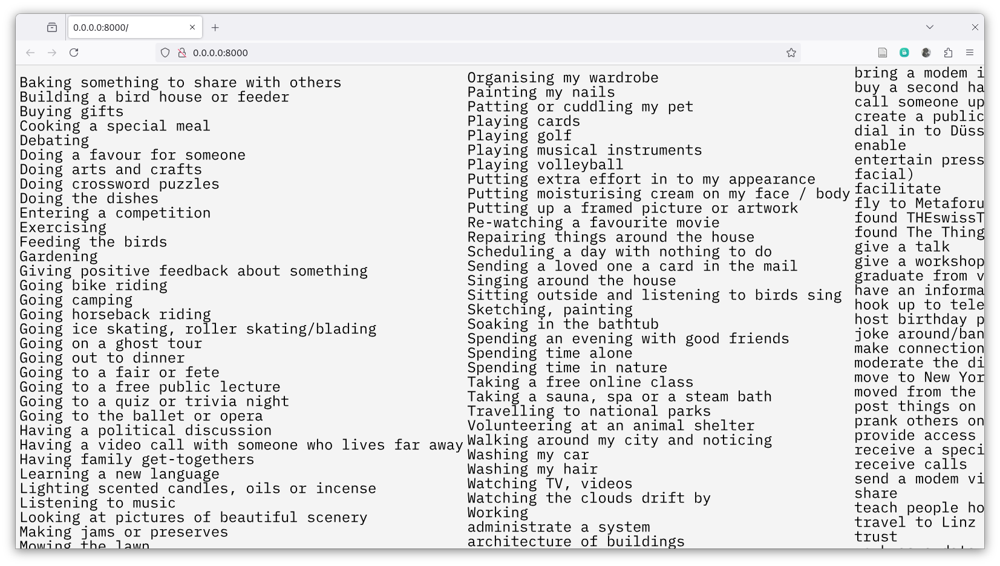
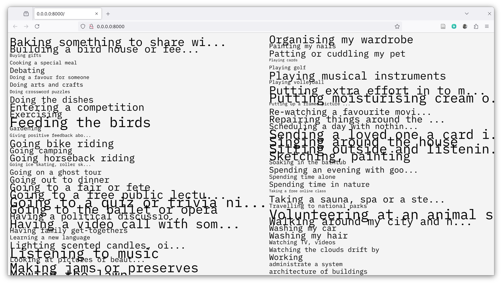
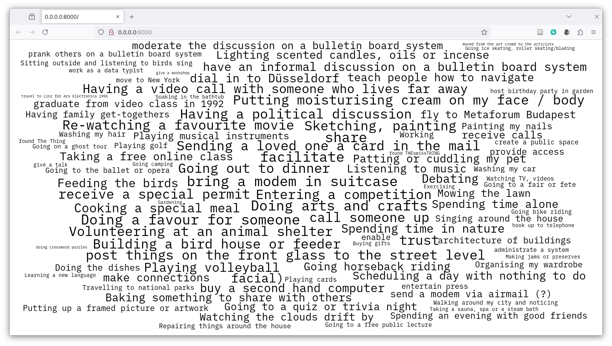
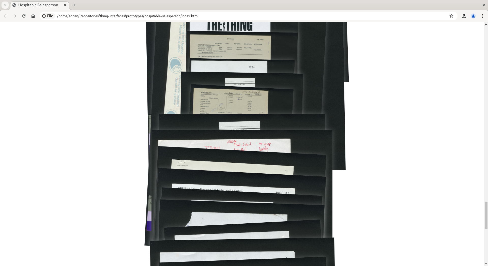
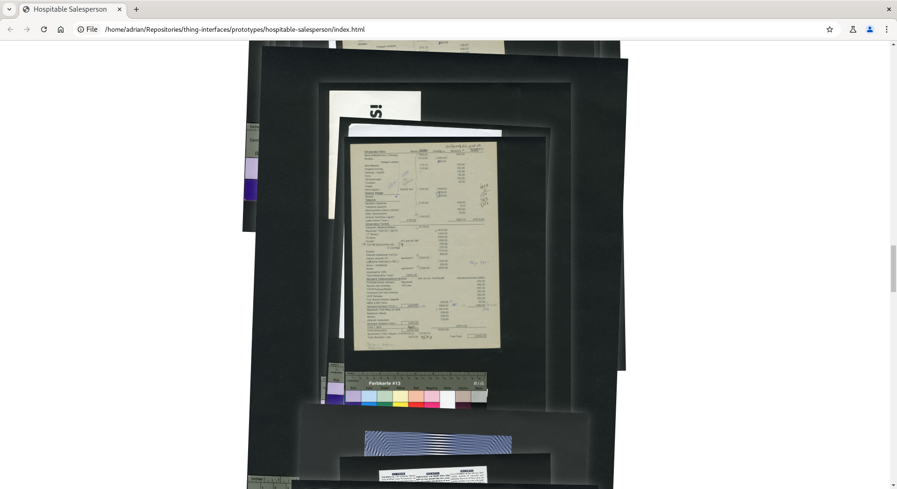
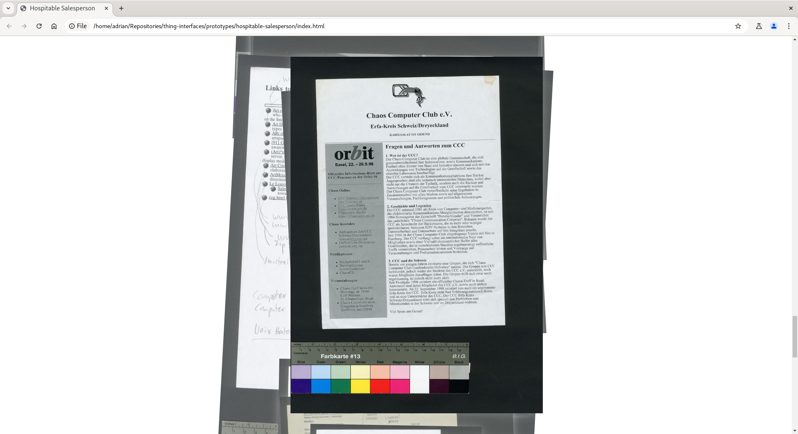

# Thing Interfaces

## Prototypes
### [Golden Microwave](https://thgie.github.io/thing-interfaces/prototypes/golden-microwave/)

Two different views of the _activities_, as simple listing and as cloud. Number-keys change some parameters

- 1: sort alphabetically
- 2: sort by randomly generated count of activity
- 3: font size by count
- 4: cut long _activities_
- 5: display as list
- 6: display as cloud

🔗 [Prototype created with Claude](https://thgie.github.io/thing-interfaces/prototypes/golden-microwave-claude.html)

### [Hospitable Salesperson](https://thgie.github.io/thing-interfaces/prototypes/hospitable-salesperson/)

Interface with focus on the materials of the archive. These are not included in this repository. The idea was to kind of flip through the various artefacts.

*Screencast of the interface*

## License
This work is licensed under a
[Creative Commons Attribution 4.0 International License][cc-by].

[![CC BY 4.0][cc-by-image]][cc-by]

[cc-by]: http://creativecommons.org/licenses/by/4.0/
[cc-by-image]: https://i.creativecommons.org/l/by/4.0/88x31.png
